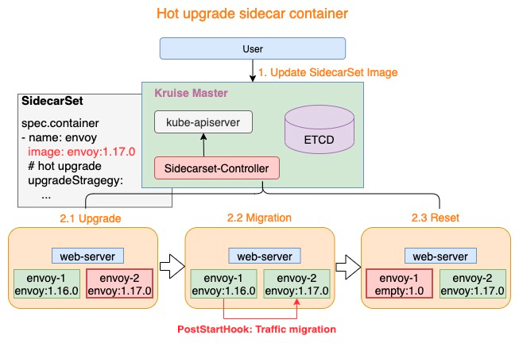
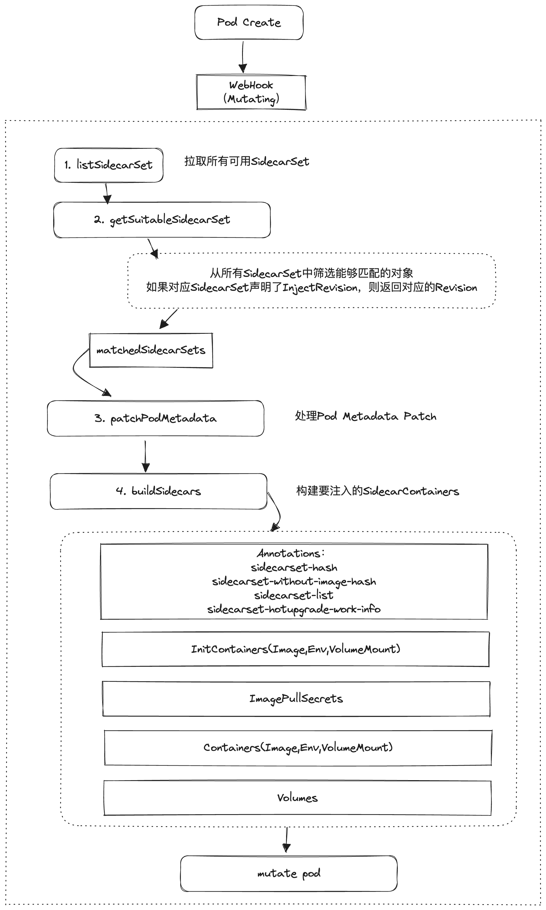
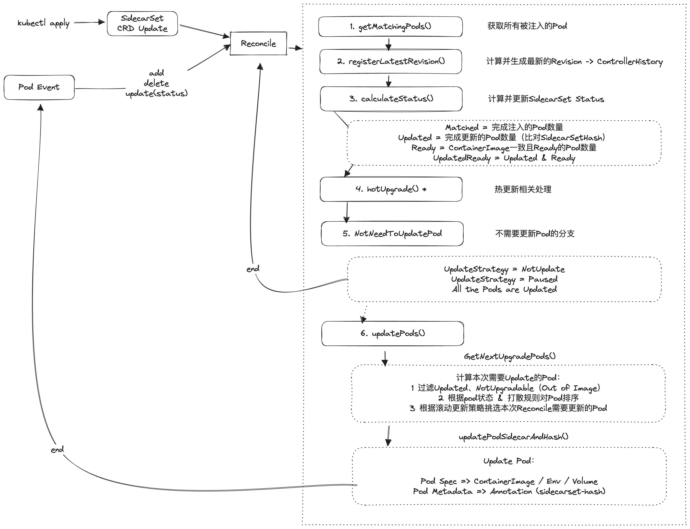

# SidecarSet

## 目标

提供一套可以用于横向管理Sidecar容器的CRD，能够支撑整个集群中Sidecar容器的注入、回滚等操作

参考：https://openkruise.io/zh/docs/user-manuals/sidecarset

## API设计

```go
// SidecarSet is the Schema for the sidecarsets API
type SidecarSet struct {
	metav1.TypeMeta   `json:",inline"`
	metav1.ObjectMeta `json:"metadata,omitempty"`

	Spec   SidecarSetSpec   `json:"spec,omitempty"`
	Status SidecarSetStatus `json:"status,omitempty"`
}
```

### Spec

SidecarSet的Spec定义非常接近于一个常规的Deployment定义

```go
// SidecarSetSpec defines the desired state of SidecarSet
type SidecarSetSpec struct {
	// 用于圈选可注入Pod的LabelSelector
	Selector *metav1.LabelSelector `json:"selector,omitempty"`

	// 声明作用的namespace（如果不声明，则作用于所有namespace）
	Namespace string `json:"namespace,omitempty"`

	// 同上，但是可匹配多个namespace
	NamespaceSelector *metav1.LabelSelector `json:"namespaceSelector,omitempty"`

	// 要注入的InitContainers；InitContainers注入只能在Pod创建时注入，不会对已经存在对Pod生效
	InitContainers []SidecarContainer `json:"initContainers,omitempty"`

	// 要注入的Containers
	Containers []SidecarContainer `json:"containers,omitempty"`

	// 声明Sidecar Containers使用的存储卷
	Volumes []corev1.Volume `json:"volumes,omitempty"`

	// Sidecar容器更新策略
	UpdateStrategy SidecarSetUpdateStrategy `json:"updateStrategy,omitempty"`

	// Sidecar容器注入策略
	InjectionStrategy SidecarSetInjectionStrategy `json:"injectionStrategy,omitempty"`

	// 拉取容器镜像的凭证
	ImagePullSecrets []corev1.LocalObjectReference `json:"imagePullSecrets,omitempty"`

	// RevisionHistoryLimit indicates the maximum quantity of stored revisions about the SidecarSet.
	// default value is 10
	RevisionHistoryLimit *int32 `json:"revisionHistoryLimit,omitempty"`

	// 用于支持对Pod元信息进行注入修改的诉求
	PatchPodMetadata []SidecarSetPatchPodMetadata `json:"patchPodMetadata,omitempty"`
}
```

### Status

```go
// SidecarSetStatus defines the observed state of SidecarSet
type SidecarSetStatus struct {
	// observedGeneration is the most recent generation observed for this SidecarSet. It corresponds to the
	// SidecarSet's generation, which is updated on mutation by the API Server.
	// 用于Controller中区分迭代次数
	ObservedGeneration int64 `json:"observedGeneration,omitempty"`

	// match了多少个Pod
	MatchedPods int32 `json:"matchedPods"`

	// match的Pod中，有多少个Pod已经更新到最新版本的sidecarset
	UpdatedPods int32 `json:"updatedPods"`

	// 处于Ready状态的Pod数量
	ReadyPods int32 `json:"readyPods"`

	// 处于Ready状态且更新到最新版本的Pod数量
	UpdatedReadyPods int32 `json:"updatedReadyPods,omitempty"`

	// SidecarSet最新的Controller Revision hash
	LatestRevision string `json:"latestRevision,omitempty"`

	// CollisionCount is the count of hash collisions for the SidecarSet. The SidecarSet controller
	// uses this field as a collision avoidance mechanism when it needs to create the name for the
	// newest ControllerRevision.
	CollisionCount *int32 `json:"collisionCount,omitempty"`
}
```

### Pod Annotation

```go
type SidecarSetUpgradeSpec struct {
	UpdateTimestamp              metav1.Time `json:"updateTimestamp"`
	SidecarSetHash               string      `json:"hash"`
	SidecarSetName               string      `json:"sidecarSetName"`
	SidecarList                  []string    `json:"sidecarList"`                  // sidecarSet container list
	SidecarSetControllerRevision string      `json:"controllerRevision,omitempty"` // sidecarSet controllerRevision name
}
```

```yaml
# 注入的SidecarSet的Hash元信息列表（key: sidecarSetName,value: SidecarSetUpgradeSpec)
kruise.io/sidecarset-hash: '{"demo-sidecarset":{"updateTimestamp":"2023-07-01T06:38:17Z","hash":"6wxw44dw4555d6b5c5cf5vf6d844bw948ddw5bv7zw5955c4x47vbf6fbc2v484z","sidecarSetName":"demo-sidecarset","sidecarList":["nginx-sidecar"],"controllerRevision":"demo-sidecarset-575984d5d8"},"test-sidecarset":{"updateTimestamp":"2023-07-01T06:39:56Z","hash":"x729b548zfwcw4cvbxb6w4vwzxfc2wdfc5fxcw984589548c94d9v776922xb8z6","sidecarSetName":"test-sidecarset","sidecarList":["busybox-sidecar"],"controllerRevision":"test-sidecarset-58d845b69d"}}'
# 注入的SidecarSet的Hash元信息列表，但不包含Container Image（key: sidecarSetName, value: SidecarSetUpgradeSpec）
kruise.io/sidecarset-hash-without-image: '{"demo-sidecarset":{"updateTimestamp":"2023-07-01T06:35:51Z","hash":"8vdxd4xz4cw2v2fwf6xf429d772d8xd467wf95zffb6d599v5d8c5z47z6c7579v","sidecarSetName":"demo-sidecarset","sidecarList":["nginx-sidecar"]},"test-sidecarset":{"updateTimestamp":"2023-07-01T06:35:51Z","hash":"6465vvx7v49wddz68w54bv5zw7zx282db2v8x467785x2729zx6c687bf8cx4885","sidecarSetName":"test-sidecarset","sidecarList":["busybox-sidecar"]}}'
# 已经注入的sidecarset的name list
kruise.io/sidecarset-injected-list: demo-sidecarset,test-sidecarset
# sidecarset的inplace update状态，细化到容器, (key: sidecarSetName, value: {revision, updateTimestamp, [lastContainerStatuses]})
kruise.io/sidecarset-inplace-update-state: '{"demo-sidecarset":{"revision":"6wxw44dw4555d6b5c5cf5vf6d844bw948ddw5bv7zw5955c4x47vbf6fbc2v484z","updateTimestamp":"2023-07-01T06:38:17Z","lastContainerStatuses":{"nginx-sidecar":{"imageID":"docker-pullable://nginx@sha256:af296b188c7b7df99ba960ca614439c99cb7cf252ed7bbc23e90cfda59092305"}}}」'
# sidecarset热更新状态
kruise.io/sidecarset-working-hotupgrade-container: ''
```

## 关键能力

### Sidecar注入

SidecarSet的注入逻辑在Webhook中实现 (`webhook/pod/sidecarset.go`)，该Webhook属于MutatingAdmissionWebhook，会在Pod的创建和更新时触发

文档说明Sidecar的注入只会发生在Pod的创建阶段，但看代码Update也会处理【？？】，不过下面的注入流程分析我们还是只讨论Create的情况

注入的核心流程：

1. List得到所有的SidecarSet对象
2. 判断当前Pod是否有匹配的SidecarSet对象
3. 对于匹配上的SidecarSet对象，根据InjectPolicy声明的Revision，获取指定的Revision版本对象（通过Controller History），如果没有指定Revision版本的话，使用latest

    ```go
    matchedSidecarSets := make([]sidecarcontrol.SidecarControl, 0)
    for _, sidecarSet := range sidecarsetList.Items {
        if sidecarSet.Spec.InjectionStrategy.Paused {
            continue
        }
        if matched, err := sidecarcontrol.PodMatchedSidecarSet(h.Client, pod, &sidecarSet); err != nil {
            return false, err
        } else if !matched {
            continue
        }
        // 【3】获取指定的Revision版本对象，如果没有声明，则使用latest
        suitableSidecarSet, err := h.getSuitableRevisionSidecarSet(&sidecarSet, oldPod, pod, req.AdmissionRequest.Operation)
        if err != nil {
            return false, err
        }
        // 把最终匹配到的SidecarSet对象封装成SidecarControl对象
        control := sidecarcontrol.New(suitableSidecarSet)
        if !control.IsActiveSidecarSet() {
            continue
        }
        matchedSidecarSets = append(matchedSidecarSets, control)
    }
    ```

4. 处理 `PatchPodMetadata`，如果对应的SidecarSet中声明了 `PatchPodMetadata`，则通过Patch的方式修改Pod的元信息

    ```go
    for _, control := range matchedSidecarSets {
		sidecarSet := control.GetSidecarset()
		sk, err := sidecarcontrol.PatchPodMetadata(&pod.ObjectMeta, sidecarSet.Spec.PatchPodMetadata)
		if err != nil {
			klog.Errorf("sidecarSet(%s) update pod(%s/%s) metadata failed: %s", sidecarSet.Name, pod.Namespace, pod.Name, err.Error())
			return false, err
		} else if !sk {
			// skip = false
			skip = false
		}
	}
    ```
5. 构建要注入的容器、Annotation等信息

   ```go
   // 【params】
   // pod：pod对象
   // matchedSidecarSets：该pod匹配到的SidecarSet对象
   // 【returns】
   // sidecarContainers：要注入该pod的sidecar container
   // sidecarInitContainers：要注入该pod的 init container
   // sidecarSecrets：要注入该pod的pull image secret
   // volumesInSidecars：要注入的Volumes
   // injectedAnnotations：要注入该pod的annotation
   func buildSidecars(isUpdated bool, pod *corev1.Pod, oldPod *corev1.Pod, matchedSidecarSets []sidecarcontrol.SidecarControl) (
       sidecarContainers, sidecarInitContainers []*appsv1alpha1.SidecarContainer, sidecarSecrets []corev1.LocalObjectReference,
       volumesInSidecars []corev1.Volume, injectedAnnotations map[string]string, err error) {

       // 【1】为Pod生成Sidecarset所需的Annoataion
       injectedAnnotations = make(map[string]string)
       // Annotation1：kruise.io/sidecarset-hash
       // sidecarSet.name -> sidecarSet hash struct
       sidecarSetHash := make(map[string]sidecarcontrol.SidecarSetUpgradeSpec)
       // Annotation2：SidecarSet Without Image Hash
       // sidecarSet.name -> sidecarSet hash(without image) struct
       sidecarSetHashWithoutImage := make(map[string]sidecarcontrol.SidecarSetUpgradeSpec)
       // 从Pod的Annotation中解析已有的SidecarSet Hash（略）
       if oldHashStr := pod.Annotations[sidecarcontrol.SidecarSetHashAnnotation]; len(oldHashStr) > 0 {
           // ...
       }
       // 从Pod的Annotation中解析已有的SidecarSet Without Image Hash（略）
       if oldHashStr := pod.Annotations[sidecarcontrol.SidecarSetHashWithoutImageAnnotation]; len(oldHashStr) > 0 {
           // ...
       }
       // 计算SidecarSet热更新相关的Annotation
       // hotUpgrade work info, sidecarSet.spec.container[x].name -> pod.spec.container[x].name
       // for example: mesh -> mesh-1, envoy -> envoy-2
       hotUpgradeWorkInfo := sidecarcontrol.GetPodHotUpgradeInfoInAnnotations(pod)
       // 计算SidecarSetList的Annotation
       sidecarSetNames := sets.NewString()
       if sidecarSetListStr := pod.Annotations[sidecarcontrol.SidecarSetListAnnotation]; sidecarSetListStr != "" {
           sidecarSetNames.Insert(strings.Split(sidecarSetListStr, ",")...)
       }

       for _, control := range matchedSidecarSets {
           sidecarSet := control.GetSidecarset()
           klog.V(3).Infof("build pod(%s/%s) sidecar containers for sidecarSet(%s)", pod.Namespace, pod.Name, sidecarSet.Name)
           // sidecarSet List
           sidecarSetNames.Insert(sidecarSet.Name)
           // pre-process volumes only in sidecar
           volumesMap := getVolumesMapInSidecarSet(sidecarSet)
           // 计算生成SidecarSetHash Annotation
           setUpgrade1 := sidecarcontrol.SidecarSetUpgradeSpec{
               UpdateTimestamp:              metav1.Now(),
               SidecarSetHash:               sidecarcontrol.GetSidecarSetRevision(sidecarSet),
               SidecarSetName:               sidecarSet.Name,
               SidecarSetControllerRevision: sidecarSet.Status.LatestRevision,
           }
           // 计算生成SidecarSet Without Image Hash Annotation 
           setUpgrade2 := sidecarcontrol.SidecarSetUpgradeSpec{
               UpdateTimestamp: metav1.Now(),
               SidecarSetHash:  sidecarcontrol.GetSidecarSetWithoutImageRevision(sidecarSet),
               SidecarSetName:  sidecarSet.Name,
           }

           // 处理SidecarSet中的InitContainers和PullSecrets，这两个只有Create阶段可以注入
           if !isUpdated {
               for i := range sidecarSet.Spec.InitContainers {
                   initContainer := &sidecarSet.Spec.InitContainers[i]
                   // volumeMounts that injected into sidecar container
                   // when volumeMounts SubPathExpr contains expansions, then need copy container EnvVars(injectEnvs)
                   injectedMounts, injectedEnvs := sidecarcontrol.GetInjectedVolumeMountsAndEnvs(control, initContainer, pod)
                   // get injected env & mounts explicitly so that can be compared with old ones in pod
                   transferEnvs := sidecarcontrol.GetSidecarTransferEnvs(initContainer, pod)
                   // append volumeMounts SubPathExpr environments
                   transferEnvs = util.MergeEnvVar(transferEnvs, injectedEnvs)
                   klog.Infof("try to inject initContainer sidecar %v@%v/%v, with injected envs: %v, volumeMounts: %v",
                       initContainer.Name, pod.Namespace, pod.Name, transferEnvs, injectedMounts)
                   // 计算过程中将需要注入的VolumeMounts加入到volumesInSidecars中
                   for _, mount := range initContainer.VolumeMounts {
                       volumesInSidecars = append(volumesInSidecars, *volumesMap[mount.Name])
                   }
                   // merge VolumeMounts from sidecar.VolumeMounts and shared VolumeMounts
                   initContainer.VolumeMounts = util.MergeVolumeMounts(initContainer.VolumeMounts, injectedMounts)
                   // add "IS_INJECTED" env in initContainer's envs
                   initContainer.Env = append(initContainer.Env, corev1.EnvVar{Name: sidecarcontrol.SidecarEnvKey, Value: "true"})
                   // merged Env from sidecar.Env and transfer envs
                   initContainer.Env = util.MergeEnvVar(initContainer.Env, transferEnvs)
                  【2】计算生成要注入的InitContainers
                   sidecarInitContainers = append(sidecarInitContainers, initContainer)
               }
               // 【3】计算生成 imagePullSecrets
               sidecarSecrets = append(sidecarSecrets, sidecarSet.Spec.ImagePullSecrets...)
           }

           sidecarList := sets.NewString()
           isInjecting := false
           // 处理常规sidecar容器
           for i := range sidecarSet.Spec.Containers {
               sidecarContainer := &sidecarSet.Spec.Containers[i]
               sidecarList.Insert(sidecarContainer.Name)
               // volumeMounts that injected into sidecar container
               // when volumeMounts SubPathExpr contains expansions, then need copy container EnvVars(injectEnvs)
               injectedMounts, injectedEnvs := sidecarcontrol.GetInjectedVolumeMountsAndEnvs(control, sidecarContainer, pod)
               // get injected env & mounts explicitly so that can be compared with old ones in pod
               transferEnvs := sidecarcontrol.GetSidecarTransferEnvs(sidecarContainer, pod)
               // append volumeMounts SubPathExpr environments
               transferEnvs = util.MergeEnvVar(transferEnvs, injectedEnvs)
               klog.Infof("try to inject Container sidecar %v@%v/%v, with injected envs: %v, volumeMounts: %v",
                   sidecarContainer.Name, pod.Namespace, pod.Name, transferEnvs, injectedMounts)
               //when update pod object
               if isUpdated {
                   // judge whether inject sidecar container into pod
                   needInject, existSidecars, existVolumes := control.NeedToInjectInUpdatedPod(pod, oldPod, sidecarContainer, transferEnvs, injectedMounts)
                   if !needInject {
                       sidecarContainers = append(sidecarContainers, existSidecars...)
                       volumesInSidecars = append(volumesInSidecars, existVolumes...)
                       continue
                   }

                   klog.V(3).Infof("upgrade or insert sidecar container %v during upgrade in pod %v/%v",
                       sidecarContainer.Name, pod.Namespace, pod.Name)
                   //when created pod object, need inject sidecar container into pod
               } else {
                   klog.V(3).Infof("inject new sidecar container %v during creation in pod %v/%v",
                       sidecarContainer.Name, pod.Namespace, pod.Name)
               }
               isInjecting = true
               // 计算过程中将需要注入的VolumeMounts加入到volumesInSidecars中
               for _, mount := range sidecarContainer.VolumeMounts {
                   volumesInSidecars = append(volumesInSidecars, *volumesMap[mount.Name])
               }
               // merge VolumeMounts from sidecar.VolumeMounts and shared VolumeMounts
               sidecarContainer.VolumeMounts = util.MergeVolumeMounts(sidecarContainer.VolumeMounts, injectedMounts)
               // add the "Injected" env to the sidecar container
               sidecarContainer.Env = append(sidecarContainer.Env, corev1.EnvVar{Name: sidecarcontrol.SidecarEnvKey, Value: "true"})
               // merged Env from sidecar.Env and transfer envs
               sidecarContainer.Env = util.MergeEnvVar(sidecarContainer.Env, transferEnvs)

               // when sidecar container UpgradeStrategy is HotUpgrade
               if sidecarcontrol.IsHotUpgradeContainer(sidecarContainer) {
                   hotContainers, annotations := injectHotUpgradeContainers(hotUpgradeWorkInfo, sidecarContainer)
                   sidecarContainers = append(sidecarContainers, hotContainers...)
                   for k, v := range annotations {
                       injectedAnnotations[k] = v
                   }
               } else {
                   // 【4】计算生成要注入的常规Sidecar Containers
                   sidecarContainers = append(sidecarContainers, sidecarContainer)
               }
           }
           // the container was (re)injected and the annotations need to be updated
           if isInjecting {
               setUpgrade1.SidecarList = sidecarList.List()
               setUpgrade2.SidecarList = sidecarList.List()
               sidecarSetHash[sidecarSet.Name] = setUpgrade1
               sidecarSetHashWithoutImage[sidecarSet.Name] = setUpgrade2
           }
       }

       // 【5】处理要注入的Annotations
       by, _ := json.Marshal(sidecarSetHash)
       injectedAnnotations[sidecarcontrol.SidecarSetHashAnnotation] = string(by)
       by, _ = json.Marshal(sidecarSetHashWithoutImage)
       injectedAnnotations[sidecarcontrol.SidecarSetHashWithoutImageAnnotation] = string(by)
       sidecarSetNameList := strings.Join(sidecarSetNames.List(), ",")
       // store matched sidecarset list in pod annotations
       injectedAnnotations[sidecarcontrol.SidecarSetListAnnotation] = sidecarSetNameList
       return sidecarContainers, sidecarInitContainers, sidecarSecrets, volumesInSidecars, injectedAnnotations, nil
   }
    ```
   
6. 上一步骤中，通过计算最终得到以下需要注入的内容：
   - sidecarContainers：需要注入的常规Sidecar Containers
   - sidecarInitContainers：需要注入的InitContainers
   - sidecarSecrets：需要注入的imagePullSecrets
   - volumesInSidecars：需要注入的VolumeMounts
   - injectedAnnotations：需要注入的Annotations
   
   接下来就是分步骤进行实际的注入（即更新Pod Spec）

7. (注入1)：完成InitContainers的注入

    ```go
    sort.SliceStable(sidecarInitContainers, func(i, j int) bool {
		return sidecarInitContainers[i].Name < sidecarInitContainers[j].Name
	})
	for _, initContainer := range sidecarInitContainers {
		pod.Spec.InitContainers = append(pod.Spec.InitContainers, initContainer.Container)
	}
    ```
   
8. (注入2)：完成常规Sidecar Containers的注入

    ```go
	pod.Spec.Containers = mergeSidecarContainers(pod.Spec.Containers, sidecarContainers)
   
    // 这里merge函数会根据PodInjectPolicy的BeforeAppContainers和AfterAppContainers决定注入的位置
    // 如果容器中已经有对应name的container，会执行替换（index不变，但定义变为sidecarContainer中的定义）
    ```
   
9. (注入3)：完成Volumes的注入

    ```go
    pod.Spec.Volumes = util.MergeVolumes(pod.Spec.Volumes, volumesInSidecar)
    ```
10. (注入4)：完成imagePullSecrets的注入

    ```go
    pod.Spec.ImagePullSecrets = mergeSidecarSecrets(pod.Spec.ImagePullSecrets, sidecarSecrets)
    ```

11. （注入5）：完成Pod Annotation注入

   ```go
   for k, v := range injectedAnnotations {
		pod.Annotations[k] = v
   }
   ```

至此注入完毕，更新通过 `*pod` 指针传递，最终由Pod Webhook进行Mutating，修改实际持久化的对象

### 版本控制机制

1. 版本的计算：hash

   对于一个SidecarSet，其唯一标识符是通过对整个Object进行hash计算得到的（参照：`pkg/control/sidecarcontrol/hash.go`）；除了这个hash之外，还有一个withoutImageHash，区别在于计算的时候去除了所有container的image信息（主要是用于判断是否可以原地升级）

   这个hash会随着SidecarSet的定义的变化而变化，所以也可以认为是SidecarSet的版本号，在ControllerHistory中，就是以这个hash作为Revision的key来存储历史版本的。

   hash的更新发生在SidecarSet的Mutate Webhook中

2. 注入时的版本控制

   默认情况下SidecarSet对新创建的Pod进行注入时都是采用最新版本，但可以通过`injectionStrategy`或者`apps.kruise.io/sidecarset-custom-version`label来指定具体的Revision版本，从而实现注入指定版本。

   提供指定版本注入的能力，是为了解决下面这种场景的问题：

   假设SidecarSet在进行灰度更新（Update），这时被注入的Workload如CloneSet发生了扩容或者Pod重建，那么就会直接注入最新的SidecarSet，这可能会干扰灰度逻辑。

   所以提供了指定版本注入的能力，可以在灰度更新时指定注入旧版本的SidecarSet，从而避免上述问题。

   SidecarSet当前的最新Revision存储在Status的`LatestRevision`中，每次更新都会生成新的Revision存入Controller History，并更新该状态。

### 更新流程（Reconcile）

SidecarSet CRD发生Update后，就会触发Controller的Reconcile逻辑，SidecarSet CRD的Update只会对已经注入成功的Pod进行In-place Update，对于没有注入的Pod是不会进行操作的。

另外In place Update只支持Container Image的修改（K8S限制），如果有其他内容发生了修改就不会进行原地更新。

有两种事件会触发SidecarSet的Reconcile：

- SidecarSet CRD发生Update，会触发SidecarSet的Reconcile
- 被注入了SidecarSet的Pod发生变更（包括Add，Delete，Update），也会触发对应SidecarSet的Reconcile
  - Pod Add / Delete 事件直接触发被注入SidecarSet的Reconcile
  - Pod Update 事件，只会在Pod Status Update的时候触发Reconcile

Reconcile的整体流程大致如下：

1. 获取SidecarSet Match的所有Pod对象(需要Pod完成注入才会被筛选出来，还没有被注入的Pod即便Match也不会被筛选出来)

2. 计算SidecarSet的最新Revision，并注册到Controller History

3. 计算并更新SidecarSet的Status
   
   - Matched: 完成注入的Pod的数量
   - Updated: 通过判断Pod Annotation判断，更新到最新版本的SidecarSet的Pod数量
   - Ready: 校验Pod中SidecarSet的所有容器是否都和声明一致，并且达到Ready状态
   - UpdatedReady: Updated & Ready

4. 处理Hot Upgrade流程（暂略，后面部分详细展开）

5. 如果判断不需要对Pod进行更新，那么直接结束Reconcile，有以下几种情况：

   - SidecarSet的UpgradeStrategy为NotUpdate，结束Reconcile
   - 所有Match的Pod都已经Updated，结束Reconcile
   - SidecarSet的UpgradeStrategy为Pause，结束Reconcile

6. 对Match的Pod对象进行更新，主要是更新Pod Annotation（sidecarset-hash）以及Pod Container（Spec），详细步骤如下

   1. 计算这一次Reconcile需要更新的Pod对象，流程如下
      - 过滤已经Updated，以及NotUpgradable的Pod（修改了除镜像外字段）
      - 根据更新策略以及打散规则对过滤后的Pod进行排序
      - 根据更新策略从过滤后对Pod中Pick出本次需要更新的Pod

   2. 对Pick出来的Pod进行更新，更新的内容包括

      - Pod Spec: Container Image / Env / Volume
      - Pod Annotation: sidecarset-hash / sidecarest-without-image-hash

7. 完成本轮Reconcile

### 更新打散

在实际使用场景中，由于Sidecar容器通常是横向管理，所以经常会出现一个SidecarSet注入多个Workload的情况，在这种情况下进行SidecarSet更新时，可能会存在升级不均匀的现象：

例如SidecarSet注入了三个CloneSet A(包含1000个pod),B(包含1000个pod),C(包含10个pod)，SidecarSet在分批更新时是将所有的pod打平去滚动更新的，那么由于C的pod数量很少，就很有可能出现在某一个批次中，C的pod被一次性更新完毕，这是不太符合灰度理念的。

为了解决这种问题，SidecarSet在UpdateStrategy中，提供了Scatter打散机制，可以通过声明一组（或多组）label，来保证对应label圈选的pod在发布过程中是被均匀打散的，例如：

```yaml
apiVersion: apps.kruise.io/v1alpha1
kind: SidecarSet
metadata:
  name: sidecarset
spec:
  # ...
  updateStrategy:
    type: RollingUpdate
    scatterStrategy:
    - key: foo
      value: bar
```

假设SidecarSet一共注入10个Pod，其中3个Pod满足foo=bar的label，那么这三个pod将打散在第1，6，10个被更新（具体批次看设置）。

打散的逻辑实现就在Reconcile的排序过程中（上面的6-1），代码如下：

```go
// term = labelKV
// pods = 所有pods
// indexes = pods的原有index
// ret =  打散后各个pod的index
func (ss *scatterSort) scatterPodsByRule(term appsv1alpha1.UpdateScatterTerm, pods []*v1.Pod, indexes []int) (ret []int) {

	// 1. 将匹配label的pod和不匹配label的pod分成两个group
	var matchedIndexes, unmatchedIndexes []int
	var totalMatched, totalUnmatched int

	for _, i := range indexes {
		if pods[i].Labels[term.Key] == term.Value {
			matchedIndexes = append(matchedIndexes, i)
		} else {
			unmatchedIndexes = append(unmatchedIndexes, i)
		}
	}

	if len(matchedIndexes) <= 1 || len(unmatchedIndexes) <= 1 {
		return indexes
	}

	for i := 0; i < len(pods); i++ {
		if pods[i] == nil {
			continue
		}
		if pods[i].Labels[term.Key] == term.Value {
			totalMatched++
		} else {
			totalUnmatched++
		}
	}

	// 2. keep the last matched one and append to the indexes returned
	lastMatchedIndex := matchedIndexes[len(matchedIndexes)-1]
	defer func() {
		ret = append(ret, lastMatchedIndex)
	}()
	matchedIndexes = matchedIndexes[:len(matchedIndexes)-1]
	totalMatched--

	// 3. calculate group number and size that pods to update should be combined
	group := calculateGroupByDensity(totalMatched, totalUnmatched, len(matchedIndexes), len(unmatchedIndexes))
	newIndexes := make([]int, 0, len(indexes))

	if group.unmatchedRemainder > 0 {
		newIndexes = append(newIndexes, unmatchedIndexes[:group.unmatchedRemainder]...)
		unmatchedIndexes = unmatchedIndexes[group.unmatchedRemainder:]
	}

	for i := 0; i < group.groupNum; i++ {
		matchedIndexes, newIndexes = migrateItems(matchedIndexes, newIndexes, group.matchedGroupSize)
		unmatchedIndexes, newIndexes = migrateItems(unmatchedIndexes, newIndexes, group.unmatchedGroupSize)
	}

	if len(matchedIndexes) > 0 {
		newIndexes = append(newIndexes, matchedIndexes...)
	}
	if len(unmatchedIndexes) > 0 {
		newIndexes = append(newIndexes, unmatchedIndexes...)
	}

	return newIndexes
}
```

```go
func calculateGroupByDensity(totalMatched, totalUnmatched, updateMatched, updateUnmatched int) scatterGroup {
	totalGroup := newScatterGroup(totalMatched, totalUnmatched)
	updateGroup := newScatterGroup(updateMatched, updateUnmatched)

	if float32(totalUnmatched)/float32(totalMatched) >= float32(updateUnmatched)/float32(updateMatched) {
		return updateGroup
	}

	newGroup := scatterGroup{matchedGroupSize: totalGroup.matchedGroupSize, unmatchedGroupSize: totalGroup.unmatchedGroupSize}
	if updateMatched/newGroup.matchedGroupSize < updateUnmatched/newGroup.unmatchedGroupSize {
		newGroup.groupNum = updateMatched / newGroup.matchedGroupSize
	} else {
		newGroup.groupNum = updateUnmatched / newGroup.unmatchedGroupSize
	}
	newGroup.unmatchedRemainder = updateUnmatched - newGroup.groupNum*newGroup.unmatchedGroupSize
	return newGroup
}
```

这里源码有些复杂，我们简单看下思路，打散采用的是分组算法，简单来说是：

1. 将所有的pod分成两组，一组是匹配label的(matched)，一组是不匹配label的(unmatched)
2. 计算要打散成多少组（groupNum），这个组数取值是min(matched,unmatched)，出发点是尽可能保证少数pod的均匀打散
3. 计算每组中包含多少个matched和unmatched，这里只要知道groupNum之后对两组pod做均分即可
4. 按照顺序不断append matched和unmatched即可

举个例子

一共10个pod，2个matched label，8个unmatched label，序号从 1～ 10 (1,2 matched, 3-10 unmatched)

groupNum计算得到是2，也就是将10个pod分成两组，每组里包含1个matched和4个unmatched

按顺序对每个组进行append，最后排序的结果就是：

```
[(1), 3, 4, 5 , 6 | (2), 7, 8, 9, 10]
```

上述的说明只是实际算法实现中最简单的一种case，实际上要复杂很多，例如需要考虑尾部集中效应，多label混合打散等，但在此不做展开了

### 热升级

Sidecar Container的In place升级会重启容器，对于诸如LogAgent之类的辅助Sidecar容器来说，没有什么太大的影响，但是对于像Envoy这种流量管理类的Sidecar，如果直接执行容器重启的In place update，在重启期间会对业务容器产生有损的影响。

对于这种场景，如果想要实现Pod不重建条件下的Sidecar容器更新，就需要引入新的机制，Kruise为这种场景提供了SidecarSet热更新机制，具体的工作原理是：

为需要热更新的sidecar容器提供一个empty container，这个容器除了Image以外的所有配置都和sidecar容器一致；

在执行In place update时，SidecarSet会更新empty container到最新版本，然后需要在postStart中将原来的sidecar容器中的流量转移到新容器中，最后将原来的sidecar容器reset成empty container，以实现后续轮转：




但是注意流量Migration阶段必须要用户自己来实现对应的postStart钩子

### 核心流程图

注入流程



更新流程



热更新流程